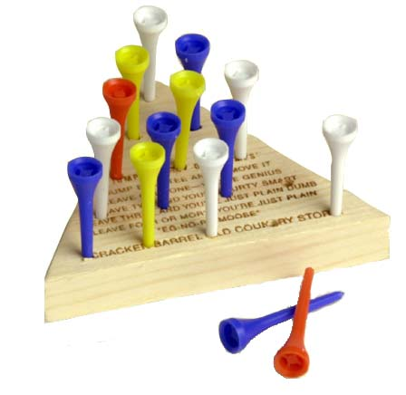
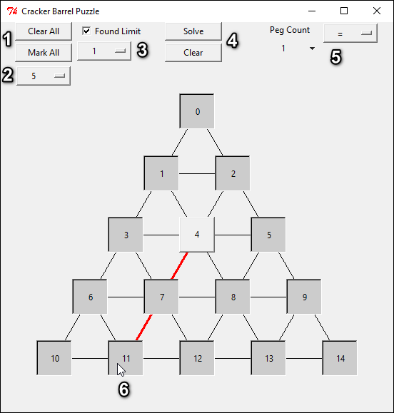
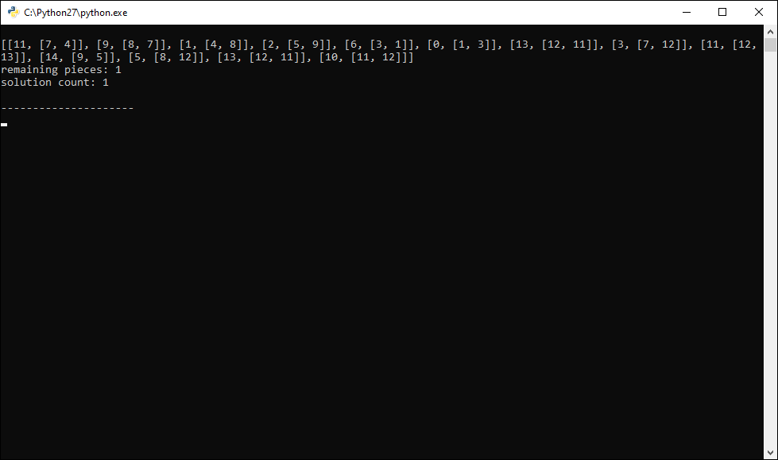

# Cracker Barrel Puzzle

## Description

Play and quickly find a variety of solutions for the classic Cracker Barrel Peg Game

## Usage

1. Clear / Mark all of the pegs
2. Specify how many rows for the puzzle (5 default for actual puzzle)
3. Check / Specify how many solutions to look for.
4. Solve and send solution(s) to console / Clear console
5. Define what solution to look for (e.g., Peg Count = 1)
6. Hovering over piece shows what moves are available

> Console output according to previous settings

[peg to move, [peg to jump over and remove, destination of moved peg]